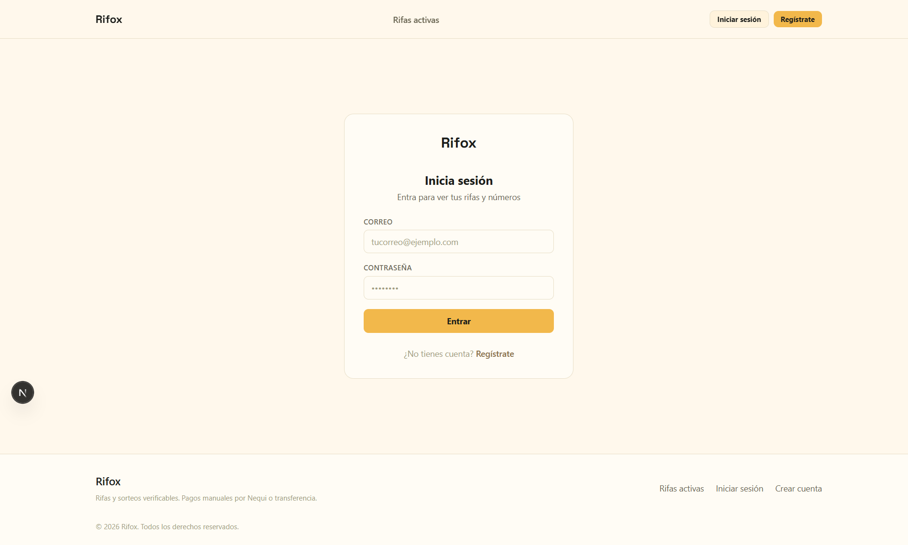
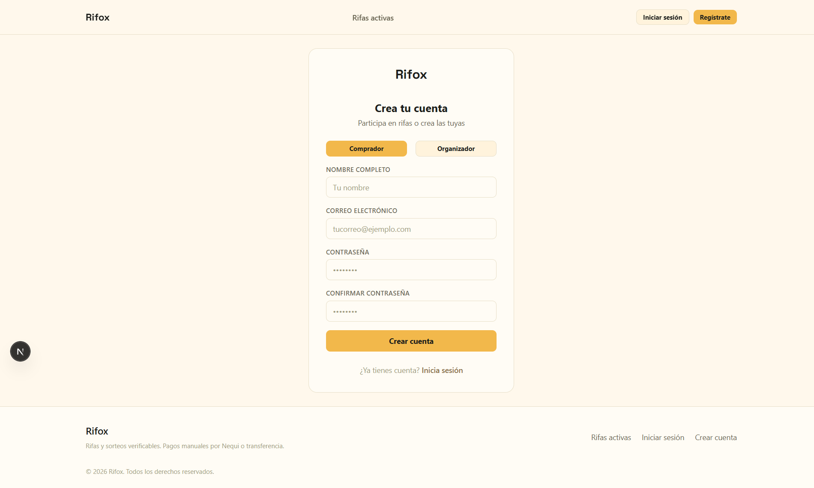
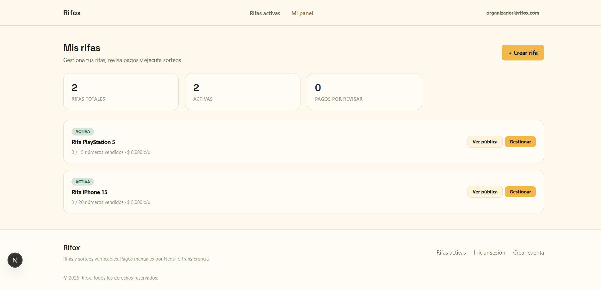
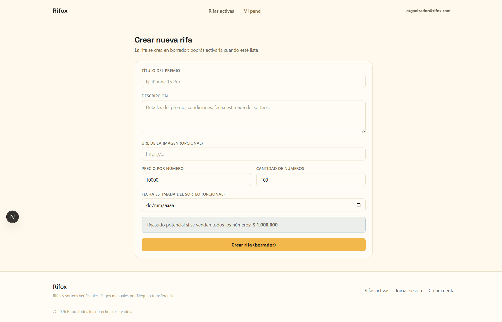
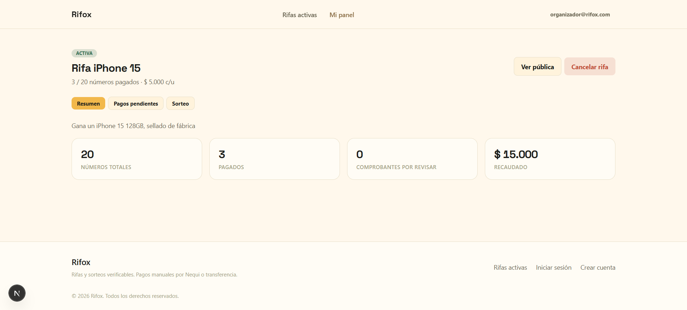
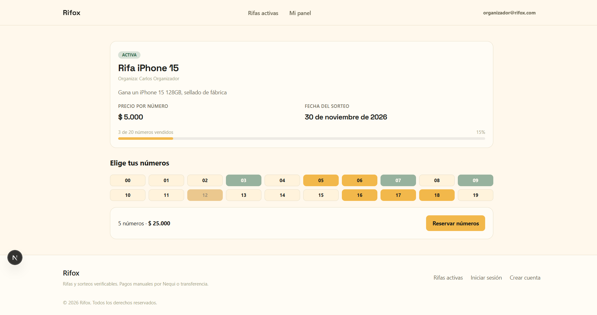
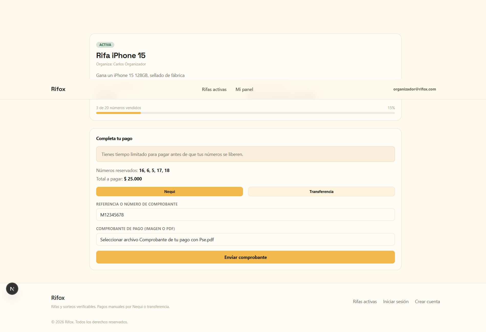
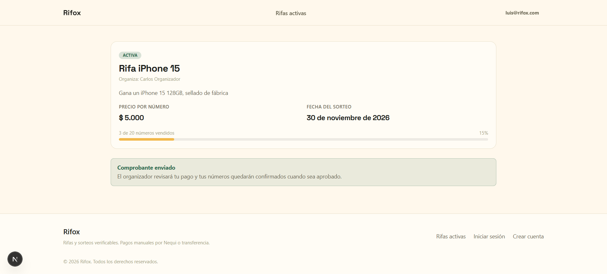
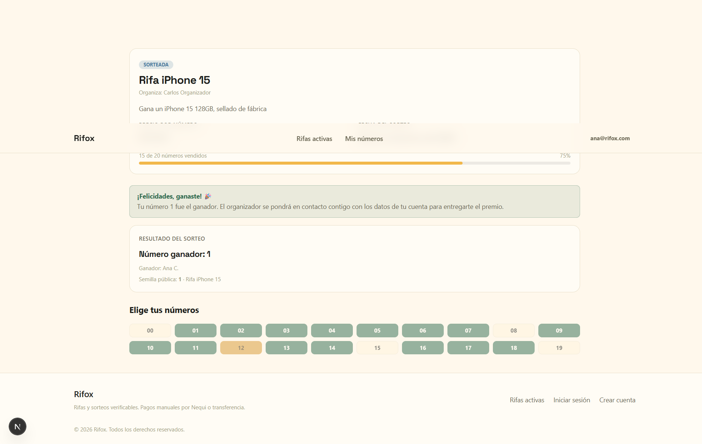
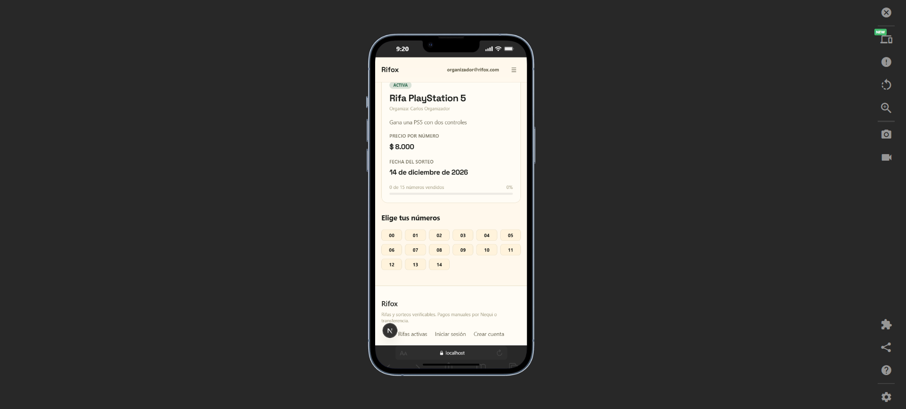

# Rifox

Plataforma de rifas y sorteos digitales. Un organizador crea una rifa (premio, precio por número, cantidad de números) y los participantes eligen, reservan y pagan sus números por Nequi o transferencia. El ganador se define de forma **verificable**, usando como semilla pública el resultado de la lotería oficial, para que nadie pueda alegar manipulación.

## Capturas

| | |
|---|---|
|  |  |
|  |  |
|  |  |
|  |  |
|  |  |

## Funcionalidades

- **Gestión de rifas:** el organizador crea rifas con premio, precio, cantidad de números y fecha del sorteo, y sigue sus ventas desde un panel.
- **Página pública por rifa:** cada rifa tiene su propio enlace (`/raffles/[slug]`) con la cuadrícula de números disponibles, reservados y pagados, y una barra de progreso de ventas.
- **Reserva atómica de números:** si dos compradores piden el mismo número al mismo tiempo, solo uno lo obtiene y a la otra operación se le revierte por completo.
- **Pagos manuales con comprobante:** el comprador paga por Nequi o transferencia y sube el comprobante; el organizador lo aprueba o lo rechaza. Al rechazarlo, los números vuelven a quedar disponibles.
- **Sorteo verificable:** el número ganador se calcula a partir de una semilla pública (por ejemplo, el resultado de la lotería del día). Cualquiera puede repetir el cálculo y obtener el mismo resultado.
- **Autenticación y roles:** JWT con refresh tokens y dos roles, organizador y comprador.

## Cómo funciona el sorteo verificable

1. El organizador registra la semilla pública y su fuente (por ejemplo, "Lotería de Bogotá - 27/08/2026").
2. Se toman solo los números **pagados**, ordenados de menor a mayor.
3. Se calcula el hash SHA-256 de la semilla y se convierte a número.
4. El índice ganador es ese número módulo la cantidad de números pagados.

Como la semilla es pública y el orden es fijo, el resultado es reproducible por cualquier persona. Mira el código en [`snippets/02-draws-verifiable-seed.ts`](snippets/02-draws-verifiable-seed.ts).

## Stack tecnológico

| Capa | Tecnología |
|---|---|
| Frontend | Next.js (App Router), TypeScript, Tailwind CSS |
| Backend | NestJS, Prisma ORM |
| Base de datos | PostgreSQL |
| Autenticación | JWT + Refresh Tokens |
| Pagos | Manuales, por Nequi o transferencia directa (sin pasarela automática) |

El diseño reutiliza la hoja de estilo base de [KNORIX](../knorix) (tipografía, radios, espaciados y componentes), con una paleta propia cálida y festiva:

| Uso | Color | Hex |
|---|---|---|
| Fondo principal | Crema cálido | `#FFF8EC` |
| Acento primario | Ámbar dorado | `#F2B84B` |
| Texto principal | Negro cálido | `#1C1E1B` |

## Modelo de datos

```
User ──< Raffle ──< RaffleNumber >── Payment
              └──── Draw (1:1)
```

- **User:** organizador o comprador.
- **Raffle:** título, premio, precio por número, total de números, fecha del sorteo y estado (`DRAFT`, `ACTIVE`, `SOLD_OUT`, `DRAWN`, `CANCELLED`).
- **RaffleNumber:** un número dentro de una rifa, con estado `AVAILABLE`, `RESERVED` o `PAID`. No se repite dentro de la misma rifa (`@@unique([raffleId, number])`).
- **Payment:** método (`NEQUI` o `BANK_TRANSFER`), comprobante, monto y estado (`PENDING`, `APPROVED`, `REJECTED`).
- **Draw:** número ganador, semilla pública y su fuente. Hay uno por rifa.

El esquema completo está en [`snippets/01-schema.prisma`](snippets/01-schema.prisma).

## Estructura del proyecto

```
rifox/
├── backend/
│   ├── prisma/          # schema.prisma
│   └── src/
│       ├── auth/        # JWT, guards, refresh tokens
│       ├── raffles/     # CRUD de rifas
│       ├── numbers/     # reserva y liberación de números
│       ├── payments/    # comprobantes y revisión del organizador
│       ├── draws/       # sorteo verificable
│       ├── users/
│       ├── common/
│       └── prisma/
└── frontend/
    └── src/
        ├── app/
        │   ├── (auth)/login, register
        │   ├── dashboard/raffles/  (listado, [id], new)
        │   └── raffles/[slug]/     # página pública de la rifa
        └── components/
```

## Decisiones técnicas destacadas

Los fragmentos de código de esta carpeta muestran las partes más interesantes del proyecto:

| Snippet | Qué muestra |
|---|---|
| [`01-schema.prisma`](snippets/01-schema.prisma) | Relación Rifa → Números → Pago y sorteo 1:1 |
| [`02-draws-verifiable-seed.ts`](snippets/02-draws-verifiable-seed.ts) | Sorteo determinístico a partir de una semilla pública |
| [`03-numbers-atomic-reservation.ts`](snippets/03-numbers-atomic-reservation.ts) | Reserva atómica con `updateMany` dentro de una transacción |
| [`04-payments-review.ts`](snippets/04-payments-review.ts) | Aprobación y rechazo de pagos con cambio de estado transaccional |
| [`05-jwt-auth.guard.ts`](snippets/05-jwt-auth.guard.ts) | Protección de rutas con JWT |
| [`06-raffle-page-flow.tsx`](snippets/06-raffle-page-flow.tsx) | Flujo de compra en tres pasos en el frontend |

## Instalación y ejecución

### Requisitos

- Node.js 18 o superior
- PostgreSQL

### Backend

```bash
cd backend
npm install
cp .env.example .env        # completa las variables (ver abajo)
npx prisma migrate dev
npm run start:dev
```

### Frontend

```bash
cd frontend
npm install
npm run dev
```

La aplicación queda disponible en `http://localhost:3000`.

### Variables de entorno (backend)

| Variable | Descripción |
|---|---|
| `DATABASE_URL` | Cadena de conexión a PostgreSQL |

Consulta `backend/.env.example` para el resto de variables (secretos JWT, puerto, etc.).

## Estado del proyecto

- [x] Autenticación con roles
- [x] Creación de rifas y página pública
- [x] Reserva de números
- [x] Pagos manuales con comprobante y revisión
- [x] Sorteo verificable
- [ ] Notificaciones por email del resultado del sorteo

## Autor

Desarrollado por **Carlos Esteban Rojas Ibarra**.