# Stok.io

Plataforma de inventario para negocios pequeños. Permite llevar el control de productos (o cualquier tipo de elemento) con categorías y ubicación, registrar entradas y salidas con su historial, recibir alertas visuales de stock bajo y exportar reportes de inventario y movimientos.

## Capturas

| | |
|---|---|
| 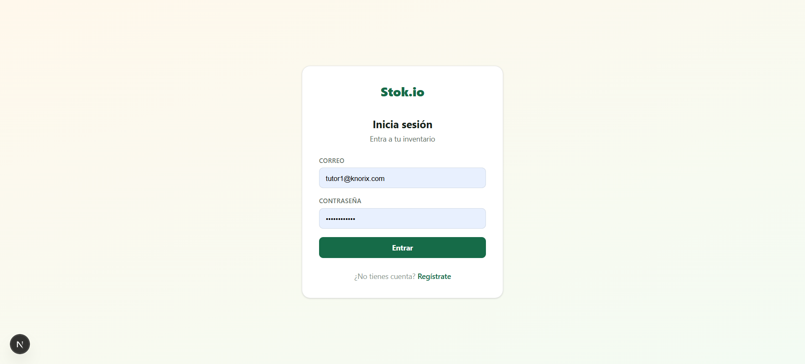 | 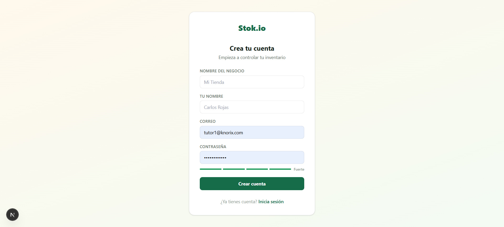 |
| 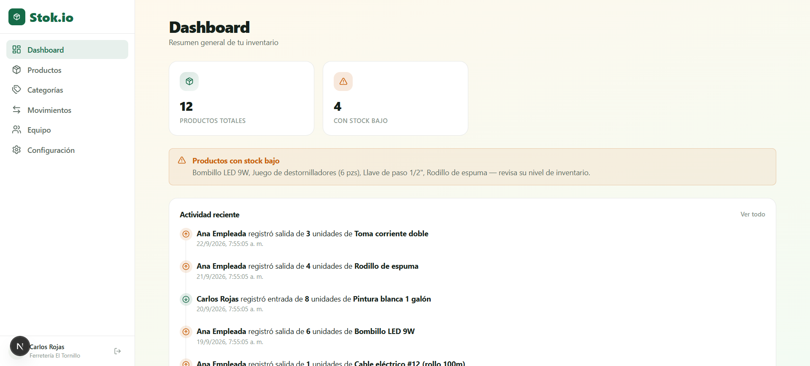 | 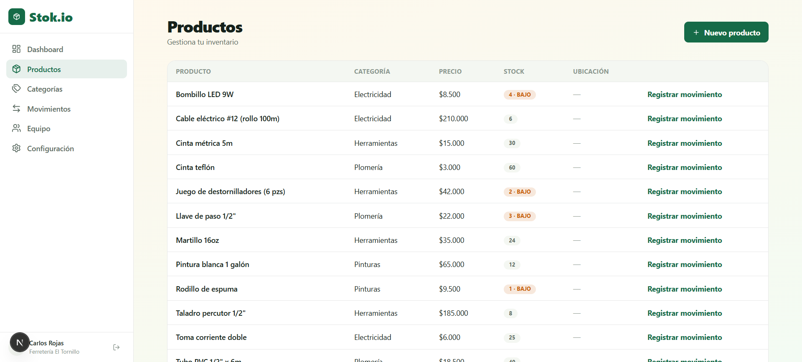 |
| 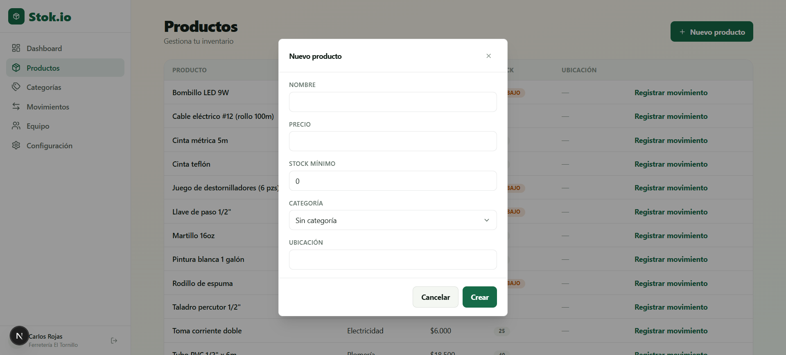 | 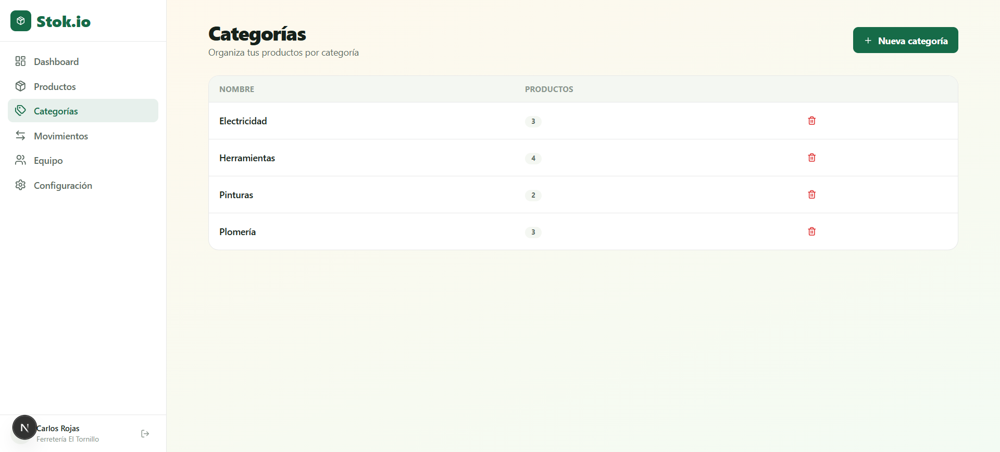 |
| 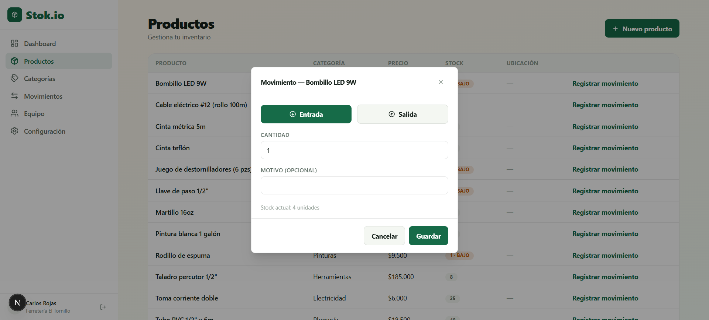 | 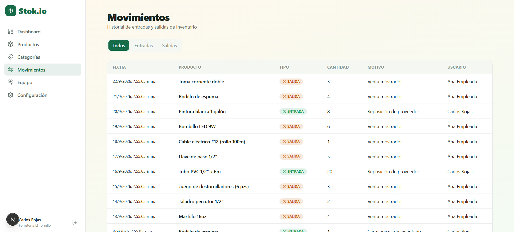 |
| 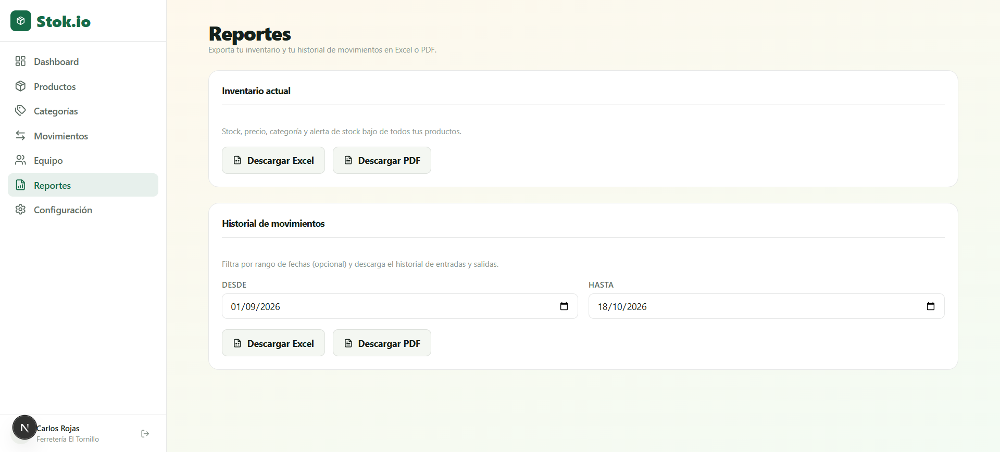 | 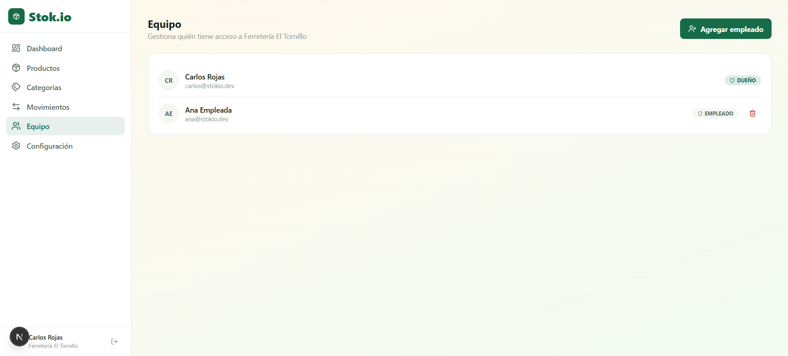 |
| 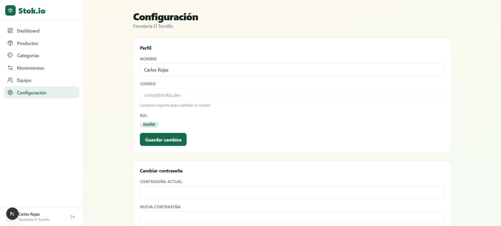 | |

## Funcionalidades

- **Productos:** alta y listado desde la interfaz, con categoría, precio, stock actual, stock mínimo y ubicación. La API también permite editar y eliminar.
- **Entradas y salidas:** cada movimiento queda registrado con su tipo, cantidad, motivo, fecha y el usuario que lo hizo. El stock se actualiza en la misma transacción que crea el movimiento.
- **Alertas de stock bajo:** los productos con stock por debajo de su mínimo se resaltan en naranja. El naranja se usa solo para este estado, nunca como color decorativo.
- **Dashboard:** métricas de productos totales, productos con stock bajo y valor total del inventario.
- **Reportes:** exportación del inventario actual y de los movimientos en PDF o Excel.
- **Equipo y roles:** el dueño del negocio invita a empleados; cada rol tiene sus permisos.
- **Autenticación:** JWT con refresh tokens.

## Stack tecnológico

| Capa | Tecnología |
|---|---|
| Frontend | Next.js (App Router), TypeScript, Tailwind CSS |
| Backend | NestJS 12, Prisma ORM 6 |
| Base de datos | PostgreSQL |
| Autenticación | JWT + Refresh Tokens (`@nestjs/jwt`, Passport, bcrypt) |
| Validación | class-validator y class-transformer |
| Reportes | Excel con ExcelJS y PDF con PDFKit |
| Pruebas y calidad | Jest, Supertest, oxlint, Prettier |
| Pagos | Manuales por Nequi (sin pasarela automática) |

El diseño reutiliza la hoja de estilo base de [KNORIX](../knorix), con una paleta propia clara y natural que transmite orden y control:

| Uso | Color | Hex |
|---|---|---|
| Fondo principal | Degradado crema a verde suave | `#FFF8EC` → `#F3FBF3` |
| Acento primario | Verde bosque | `#166B48` |
| Alerta de stock bajo | Naranja | `#C9600A` |

## Modelo de datos

```
Business ──< User (OWNER / EMPLOYEE)
   ├──< Category ──< Product ──< Movement >── User
   └──< Product
```

- **Negocio:** nombre y moneda (COP por defecto). Todos los datos pertenecen a un negocio.
- **Usuario:** pertenece a un negocio y tiene rol `OWNER` (dueño) o `EMPLOYEE` (empleado).
- **Categoría:** agrupa los productos; el nombre es único dentro de cada negocio.
- **Producto:** nombre, categoría (opcional), precio, stock actual, stock mínimo y ubicación.
- **Movimiento:** producto, tipo (entrada o salida), cantidad, usuario, fecha y motivo.

El esquema completo está en [`snippets/01-schema.prisma`](snippets/01-schema.prisma).

## Estructura del proyecto

```
stok-io/
├── backend/
│   ├── prisma/          # schema.prisma
│   └── src/
│       ├── auth/        # JWT, refresh tokens y guards
│       ├── users/       # usuarios y equipo
│       ├── categories/
│       ├── products/    # CRUD, filtros y stock bajo
│       ├── movements/   # entradas y salidas
│       ├── reports/     # exportación a PDF y Excel
│       ├── common/
│       └── prisma/
└── frontend/
    └── src/app/
        ├── (auth)/login, register
        └── (dashboard)/
            ├── dashboard/
            ├── products/
            ├── categories/
            ├── movements/
            ├── team/
            └── settings/
```

## Decisiones técnicas destacadas

| Snippet | Qué muestra |
|---|---|
| [`01-schema.prisma`](snippets/01-schema.prisma) | Modelo multi-negocio: Business, User, Category, Product y Movement |
| [`02-movements-stock-transaction.ts`](snippets/02-movements-stock-transaction.ts) | Entradas y salidas atómicas que nunca dejan el stock en negativo |
| [`03-products-low-stock.ts`](snippets/03-products-low-stock.ts) | Aislamiento por negocio y consulta de stock bajo |
| [`04-reports-export.ts`](snippets/04-reports-export.ts) | Reporte de inventario en Excel con stock bajo resaltado |
| [`05-roles.guard.ts`](snippets/05-roles.guard.ts) | Control de acceso por rol con el decorador `@Roles` |
| [`06-products-table.tsx`](snippets/06-products-table.tsx) | Tabla de productos con la alerta de stock bajo |

## Instalación y ejecución

### Requisitos

- Node.js (versión LTS reciente)
- PostgreSQL

### Backend

```bash
cd backend
npm install
cp .env.example .env        # completa las variables (ver abajo)
npx prisma migrate dev      # crea las tablas
npx prisma db seed          # datos de ejemplo (prisma/seed.ts)
npm run start:dev
```

La API queda en `http://localhost:3001`.

Otros scripts del backend:

| Script | Qué hace |
|---|---|
| `npm run build` | Compila el proyecto |
| `npm run start:prod` | Ejecuta la versión compilada (`dist/main`) |
| `npm run test` | Pruebas unitarias con Jest |
| `npm run test:e2e` | Pruebas de extremo a extremo |
| `npm run lint` | Análisis estático con oxlint |

### Frontend

```bash
cd frontend
npm install
npm run dev
```

La aplicación queda disponible en `http://localhost:3000`.

### Variables de entorno (backend)

Copia `backend/.env.example` a `backend/.env`. El archivo `.env` real nunca se sube al repositorio.

| Variable | Descripción |
|---|---|
| `DATABASE_URL` | Cadena de conexión a PostgreSQL |
| `JWT_SECRET` | Secreto para firmar los access tokens |
| `JWT_REFRESH_SECRET` | Secreto, distinto del anterior, para los refresh tokens |
| `JWT_EXPIRES_IN` | Duración del access token (por ejemplo `15m`) |
| `JWT_REFRESH_EXPIRES_IN` | Duración del refresh token (por ejemplo `7d`) |
| `FRONTEND_URL` | Origen del frontend permitido por CORS (`http://localhost:3000`) |
| `PORT` | Puerto de la API (`3001` por defecto) |
| `NODE_ENV` | Entorno (`development` o `production`) |
| `STORAGE_DRIVER` | Almacenamiento de comprobantes de pago: `local` en desarrollo o `s3` en producción |
| `FRONTEND_PUBLIC_DIR` | Ruta absoluta a `frontend/public` (solo con `STORAGE_DRIVER=local`) |
| `AWS_ACCESS_KEY_ID`, `AWS_SECRET_ACCESS_KEY`, `AWS_REGION`, `AWS_BUCKET_NAME`, `CLOUDFRONT_DOMAIN` | Solo con `STORAGE_DRIVER=s3` |

## Estado del proyecto

- [x] Autenticación con roles (dueño y empleado)
- [x] CRUD de productos y categorías
- [x] Entradas y salidas con historial
- [x] Alertas de stock bajo y dashboard de métricas
- [x] Exportación de reportes
- [x] Gestión de equipo

## Autor

Desarrollado por **Carlos Esteban Rojas Ibarra**.